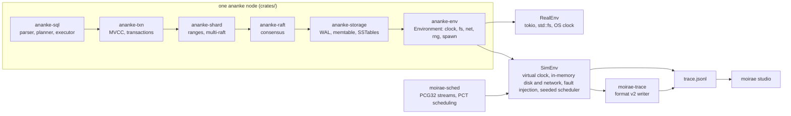

# ananke

ananke is a distributed SQL database written in Rust, built so that every failure it
can have is reproducible. Every source of non-determinism the code touches, disk,
network, clock, randomness and task scheduling, goes through one `Environment` trait.
The same code that runs on real machines runs inside a deterministic simulator that
injects torn writes, lost fsyncs, bit rot, lost directory entries, dropped and delayed
messages, partitions, clock skew and crashes, under a seed. A bug found on seed 420 is
seed 420 forever: it replays byte for byte, its trace opens in a visual studio, and it
becomes a regression test. The simulator's traces and scheduling policies come from
[moirae](https://github.com/pchrysostomou/moirae), a deterministic-simulation-testing
framework with a trace replay studio; ananke is moirae's largest consumer and moirae is
ananke's test harness.

The project is early. Phase 0 (the runtime and the simulator) is released; Phase 1 (the
storage engine) is in progress; everything above it is design only. The status table
below says exactly where things stand.

## Architecture



Solid today: `ananke-env`, `ananke-storage` up to the memtable, the simulator and the
bridge. The rest exists as sections of the [SPEC](docs/SPEC.md).

**ananke-env** (released, [crates.io](https://crates.io/crates/ananke-env)). The
`Environment` trait: `Clock`, `FileSystem` with positional I/O and explicit `sync` and
`sync_dir`, a message-oriented `Network`, `Rng`, and `spawn`. Two implementations:
`RealEnv` on tokio, and `Sim` / `SimEnv`, a single-threaded deterministic executor with
a virtual clock, per-node clock skew and drift, an in-memory network with drops,
delays, partitions and one-way blocks, an in-memory disk with the whole fault model of
SPEC §1.3, and a poll budget that turns a busy loop into a failing test. Task order is
chosen per seed by moirae's uniform or PCT scheduler; every random stream is derived
from the seed by name. A run's trace exports as a moirae format v2 trace.

**ananke-storage** (in progress). A write-ahead log: segmented, append-only, records
framed as `len | crc32c | seq | payload`, group commit through one writer task, recovery
that stops at the first torn record, bad checksum, gap or missing segment and cuts what
follows. A memtable: a skiplist holding the newest write per key with its log sequence
number, applied in sequence order once the log has acknowledged. An engine that puts
the log in front of the memtable, rotates full memtables into an immutable queue, and
flushes them through a `FlushSink`. The sink is an in-memory stand-in until SSTables
exist; the log is not truncated yet. Planned in this phase: SSTables with prefix
compression, per-block CRCs and bloom filters; a manifest; leveled compaction.

**ananke-raft, ananke-shard, ananke-txn, ananke-sql** (planned). Raft with pre-vote,
leader leases bounded by the clock drift the simulator will violate on purpose, joint
consensus; ranges over multi-raft; snapshot isolation across shards; a SQL layer. None
of this code exists yet. The design is in [SPEC §3 to §6](docs/SPEC.md).

**ananke-server** (Phase 0 protocol only). The node binary. Today it runs the echo
protocol from `sim/echo.rs` on real sockets, the same code the simulator runs, plus a
small checksummed journal that exists so the disk faults have something to bite.

## How simulation works

Every crate is generic over `E: Environment`. Nothing else in the workspace may call
`std::time`, `std::fs`, `std::net`, tokio's I/O or timers, `rand`, or spawn a thread:
clippy's `disallowed-methods` list in `clippy.toml` and a textual second check in CI
enforce it. Time is `ananke_env::Instant`; hash maps are seeded from the environment's
random stream so iteration order is part of the seed.

Under `Sim`, a scenario adds nodes, spawns their tasks on `sim.env(node)`, and drives
virtual time with `run_for`, `run_steps`, `crash`, `restart`, `partition` and `heal`.
The disk model (SPEC §1.3): a write is visible at once and durable only after `sync`;
`sync` returns Ok but persists nothing with probability `1 - p_durable`; at a crash a
random prefix of the pending writes survives, the next may survive as a torn prefix,
one bit per block flips with probability `p_bitrot`, and a random prefix of each
directory's unsynced creates, removes and renames survives. The network model (SPEC
§1.4): drops, delays, symmetric partitions and one-way blocks. The scheduler picks
which runnable task to poll next, uniformly or with probabilistic concurrency testing,
per seed.

Every state transition that matters is a trace event. This is what the echo scenario's
seed 42 records when node 3 crashes at 1.1 seconds, from
`sim/out/echo-42.jsonl`, the fixture the moirae studio's tests pin:

```jsonl
{"t":1100000000,"seq":969,"kind":"log","node":3,"event":"ananke.fs.bit-rot","data":{"path":"/echo/journal.prev","block":0,"offset":212,"bit":4}}
{"t":1100000000,"seq":970,"kind":"log","node":3,"event":"ananke.fs.write-torn","data":{"path":"/echo/journal","offset":96,"written":16,"kept":14}}
{"t":1100000000,"seq":971,"kind":"log","node":3,"event":"ananke.fs.dir-entry-lost","data":{"dir":"/echo","entry":"/echo/journal.prev","op":"rename"}}
{"t":1100000000,"seq":972,"kind":"log","node":3,"event":"ananke.fs.dir-entry-lost","data":{"dir":"/echo","entry":"/echo/journal","op":"link"}}
{"t":1100000000,"seq":977,"kind":"fault","fault":"crash","node":3,"cause":"schedule"}
{"t":1100000000,"seq":978,"kind":"fault","fault":"restart","node":3}
```

One bit of the node's rotated journal flipped, the last record of its current journal
lost two of its sixteen bytes, and the rename and create of its last rotation were
never synced and did not survive: after the restart the node finds `journal.prev`
with a corrupt record and no `journal` at all. The scenario's checks know exactly
which of those outcomes the model allows for the journal variant that skips
`sync_dir`, and that the variant that syncs must never lose an entry.

Every fault-model test runs that pair: a known-buggy variant the sweep must catch and
a correct one it must pass, under the same seeds. The write-ahead log ships with three
deliberate bugs (no `sync_dir` on rotation, no checksum at recovery, acknowledge before
sync) and the engine with one (apply to the memtable before the log); each is caught
on most seeds, and the correct code passes ten thousand.

## Status

| Phase | Deliverable | State |
|---|---|---|
| 0 | `Environment`, `RealEnv`, `SimEnv`, the fault model, the moirae bridge | Done. Tagged `v0.1.0`; `ananke-env` 0.1.0 on crates.io; [devlog](docs/devlog/00-phase-0.md) |
| 1 | Storage engine | In progress. WAL done (D-018, D-019); memtable and engine done (D-020, D-021); SSTables, manifest and compaction not started |
| 2 | Raft | Not started |
| 3 | Multi-raft sharding | Not started |
| 4 | Transactions | Not started |
| 5 | SQL | Not started |
| 6 | Security: mTLS, encryption at rest, RBAC, audit log | Not started |
| 7 | External verification: Jepsen-style harness, fuzzing | Not started |

Sweeps run `ANANKE_SEEDS` consecutive seeds per scenario: 20 at the pre-commit gate,
100 in CI on every push, 10 000 every night in release mode with failing traces
uploaded as artifacts.

## Bugs the simulator has found so far

- **A hole in the log after a lost fsync** (seed 59, [D-019](docs/DECISIONS.md)). The
  sync covering the last two records of a segment was lost, the log rotated, the next
  segment's syncs were honoured, and the crash dropped the pending tail. Recovery read
  the short segment to its clean end and went on: records 1 to 61, then 63 onward, every
  checksum valid. Records now carry their sequence number and recovery stops at a gap.
- **A stale read after out-of-order application** (seed 420, [D-021](docs/DECISIONS.md)).
  Two writes to one key acknowledged in the same group were applied by their callers
  newer-first; the memtable rotated between them, and the older write landed in the
  newer memtable and shadowed the newer one. Found by the first nightly run; writes now
  apply in sequence order.
- **An oracle that never saw a lost sync** ([commit 5112a8b](https://github.com/pchrysostomou/ananke/commit/5112a8b)).
  The harness's model of what the disk owed hard-coded one scenario's directory, so in
  the engine scenario no sync was ever counted as lost and no bit rot ever matched a
  stop. The correct engine failed its own sweep, which is how the harness bug surfaced.

## Quick start

```sh
git clone https://github.com/pchrysostomou/ananke && cd ananke
rustup toolchain install          # installs the toolchain pinned in rust-toolchain.toml
cargo build --workspace

scripts/gate.sh                   # rustfmt, clippy, the direct-I/O check, docs, every test; 20 seeds per sweep
ANANKE_SEEDS=500 cargo test --release -p ananke-sim --test engine    # a longer sweep of the engine

# The three-process echo cluster on real sockets:
cargo run -p ananke-server -- echo --listen 127.0.0.1:7001 --peers 127.0.0.1:7002,127.0.0.1:7003 --duration-secs 3
```

The echo, WAL and engine tests write their seed-42 traces to `sim/out/*.jsonl`. To open
one in the moirae studio:

```sh
npx moirae replay sim/out/engine-42.jsonl
```

## Further reading

- [docs/SPEC.md](docs/SPEC.md): what each phase builds and how.
- [docs/DECISIONS.md](docs/DECISIONS.md): why this over that, one entry per decision, never deleted.
- [docs/BACKLOG.md](docs/BACKLOG.md): what was tempting and deferred, with the reason.
- [docs/devlog/](docs/devlog/): one post per phase.
- [CLAUDE.md](CLAUDE.md): the working agreements, including the gate and the buggy-variant rule.
- [moirae](https://github.com/pchrysostomou/moirae): the simulation framework and studio; `moirae-trace` and `moirae-sched` on crates.io.

Licensed under MIT or Apache-2.0, at your option.
